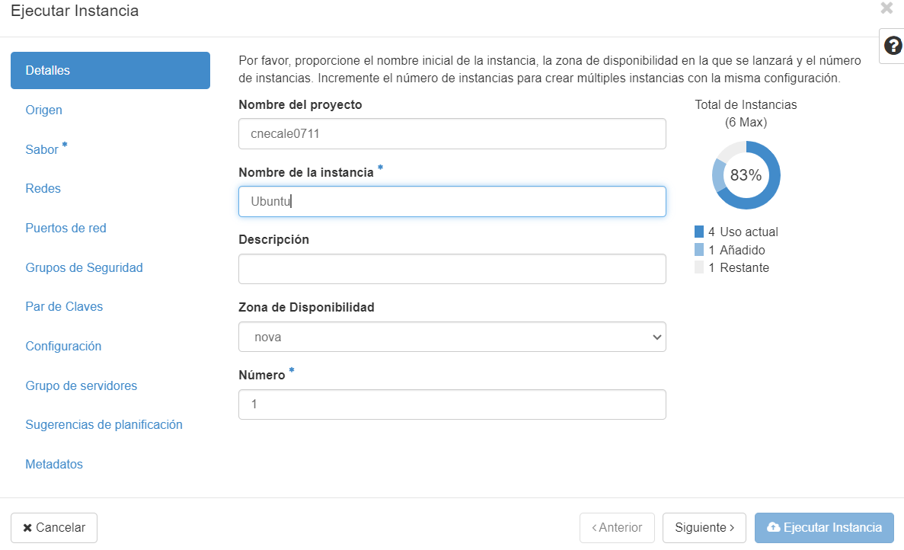
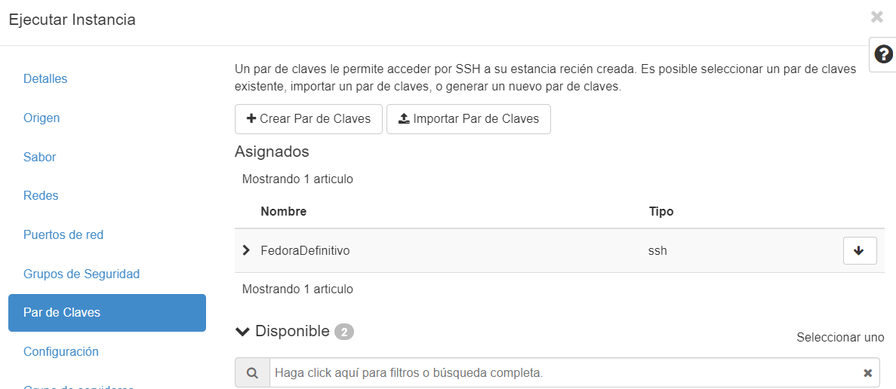

# Práctica-01-04-daw

## Intancia Ubuntu.

Primeramente tenemos que crear una instancia para realizar esta actividad, la llamo Ubuntu:

En el origen seleccionamos imagen, y le damos a NO crear un nuevo volumen.

Además vamos a seleccionar la última versión de ubuntu que hay:

En sabor escogemos a nuestro gusto, en mi caso puse 2GB de RAM:

En par de claves seleccioné una que ya tenía creada, llamada FedoraDefinitivo:

Y aquí se ve creada y funcionando la instancia de Ubuntu la cuál le hemos asociado una IP flotante:

## Descripción del proceso de creación y configuración del certificado SSL/TLS autofirmado en el servidor web Apache.

Creamos el certificado autofirmado:

Copiamos el archivo de VirtualHost de SSL/TLS:

Habilitamos el VirtualHost que acabamos de configurar:

Habilitamos el módulo SSL en Apache:

Copiamos el archivo de VirtualHost de HTTP:

Habilitamos el módulo rewrite:

Reiniciamos el servidor Apache:

Nos sale un aviso de que la conexión no es privada, y debemos entrar en configuración avanzada y pincharle a acceder a la IP flotante de nuestra instancia:

Una vez hecho esto, hemos verificado que nos funciona correctamente y saldría esto:

